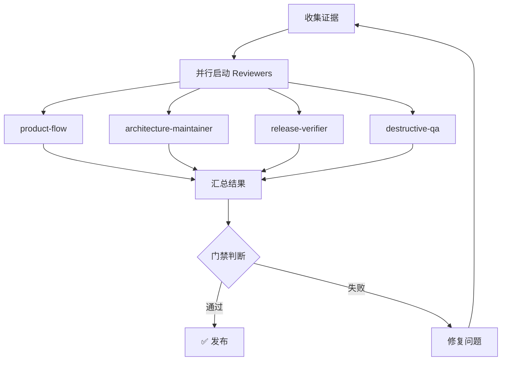

# Release Quality Review Skill

跨 Agent 工具的质量评审框架。基于「4 个常驻 Reviewer + 条件触发 Reviewer」的设计，支持 Claude Code、Codex 和其他 Agent 工具。

## 核心原则 (Core Principles)

### P1: Goal 模式约束 ⭐
- **只描述最终状态，不写实现步骤**
- 执行者有自主决策空间
- Reviewer 检查结果是否对齐目标，不检查过程
- 禁止: "按以下步骤实现..."、"参考此代码..."
- 要求: "系统应支持 X"、"Y 功能应返回 Z 格式"

### P2: 执行门禁 ⭐
- **每个 reviewer 必须提供可验证的证据**
- 禁止"代码看起来正确"作为评分依据
- 自动化检查 (build/test/typecheck) 是门槛，不是加分项
- 门槛证据必须存在才能进入评审

### P3: 对抗性审查 ⭐
- **Reviewer 必须独立运行**，不能依赖执行者的自我总结
- 存在专门的 adversarial-completion reviewer 检测伪完成
- 证据链必须可追溯、可复现
- 执行者声称的完成 ≠ 实际完成

#### 信任边界

- 可信：宿主/orchestrator、固定 commit 上的 Gate 代码、独立 reviewer、真实 report root。
- 不可信：候选子进程及其输出；它们不得写真实源码或 report root。
- 自动门禁只接受与用途匹配的受支持 runner（test、coverage 或 code-check）；候选自带的任意 Node 程序及其摘要输出不能充当验证证据。
- 验证脚本只允许用 `&&` 组合命令；所有 test 摘要必须一致且不得出现任何非零 failure。
- SHA-256 用于检测收集到仲裁之间的漂移，不是签名或远端证明。
- 能同时改写 Gate 代码、证据和相邻 metadata 的宿主写入者已越过本地信任边界；该威胁必须由受保护 CI 或外部签名证据处理。
- 直接把调用者构造的对象传给纯语义 validator，只能测试 schema/一致性检查，不能单独证明受支持 Gate 流程可被不可信候选绕过。

### P4: 持久化交接 ⭐
- **每个 phase 的计划和结果写入文件**
- 交接记录包含：输入 → 变更 → 输出 → 验收状态
- 支持回溯和问题定位
- Round N 的结果是 Round N+1 的输入

### P5: Right-size Throttle ⭐
- **根据变更规模自动调整流程复杂度**
- Micro/Small (<5 文件, <100 行): quick profile
- Medium (5-20 文件): default profile
- Large (>20 文件): release-gate profile
- XLarge (多模块): full + agentic profile
- 可用 `--profile` 覆盖自动选择
- **并行执行稳定性增强**: 根据规模自动调整超时倍率

| 规模 | 超时倍率 | 示例时间 |
|------|----------|----------|
| Micro | 0.5x | 7.5 分钟 |
| Small | 0.75x | 11 分钟 |
| Medium | 1.0x | 15 分钟 |
| Large | 1.5x | 22.5 分钟 |
| XLarge | 2.0x | 30 分钟 |

### P6: 效率优化 ⭐
- **避免重复检查，复用共享证据**
- Reviewer 之间共享检查结果（如 npm audit、pnpm build）
- 优先引用其他 Reviewer 的发现作为输入
- 不重复执行其他 Reviewer 已完成的检查
- 详见 `reviewers/TEMPLATE.md` P6 规则

### P7: 跨 Reviewer 一致性 ⭐
- **评分应该在合理范围内，与其他 Reviewer 保持一致**
- 同一 Reviewer 跨轮次评分差异应 ≤15 分
- 同时期不同 Reviewer 评分差异应 ≤20 分
- 重大偏差需在报告中说明原因
- 详见 `rubrics/scoring-addendum.md`

---

## 核心设计

```
常驻 Reviewers (每次必运行)
├── product-flow          # 产品闭环审查官
├── architecture-maintainer  # 工程架构审查官
├── release-verifier      # 验收发布审查官
└── destructive-qa        # 破坏性质量官

条件触发 Reviewers (按需启用)
├── native-designer       # UI 变更时
├── terminal-veteran      # CLI/本地服务变更时
├── data-security         # token/auth 变更时
└── zero-doc-user         # 文档/新用户场景时
```

## 快速开始

```bash
export REVIEW_AGENT=codex
export REVIEW_MODEL=gpt-5.4

# 1. 收集证据并生成独立 Reviewer prompts
node skills/release-quality-review/scripts/review-runner.mjs --profile release-gate \
  --agent "$REVIEW_AGENT" --model "$REVIEW_MODEL"

# 2. 查看结果
cat quality-reports/round-001/summary.md

# 3. 由宿主启动独立 Reviewer，修复问题后继续评审
node skills/release-quality-review/scripts/review-runner.mjs --profile release-gate --round 2 \
  --agent "$REVIEW_AGENT" --model "$REVIEW_MODEL"

# 4. 聚合某个 Reviewer 已写入的报告（诊断模式，不产生发布批准）
node skills/release-quality-review/scripts/review-gate.mjs --reviewer destructive-qa
```

## Profiles

| Profile | 用途 | Reviewers | 运行时间 |
|---------|------|-----------|----------|
| `quick` | 开发中快速检查 | product-flow, architecture-maintainer | ~5 分钟 |
| `default` | PR 合并前 | 2 个常驻 + 按需条件角色 | ~15 分钟 |
| `release-gate` | 发布前必须通过 | 4 个常驻 + 按需条件角色 | ~30 分钟 |
| `full` | 重大版本发布 | 全部 8 个 | ~60 分钟 |
| `agentic-release-gate` | XLarge 规模强制 | 4 个常驻 + 按需条件角色 + 4 个对抗角色 | ~90 分钟 |

## 对抗性审查器 (Adversarial Reviewers)

> XLarge 规模 (50+ 文件或 2000+ 行) 或 AI Agent 执行的变更必须启用

| Reviewer | 职责 | 检测内容 |
|----------|------|----------|
| `adversarial-completion` | 伪完成检测 | Happy Path Only、Selective Testing、Documentation Skipped、Scope Creep |
| `evidence-integrity` | 证据完整性 | 证据真实性、时间戳一致性、跨轮次一致性 |
| `goal-compliance` | Goal 合规性 | Goal 定义质量、反模式检测、可验证性 |
| `handoff-integrity` | 交接完整性 | 交付物完整性、上下文传递、下一步清晰度 |

**自动启用条件**:
- 变更规模为 XLarge (50+ 文件或 2000+ 行)
- 变更由 AI Agent 执行
- `--profile agentic-release-gate` 显式指定

Agentic profile 固定启用 4 个常驻和 4 个对抗 Reviewer；条件 Reviewer
仍按候选 diff 的 `trigger_conditions` 启用。Self-review 与项目评审使用同一套
选择逻辑，不得因为使用 `--target` 而自动启用全部条件 Reviewer。

## Goal 指令生成器

> 将用户需求转换为合规的 `/goal` 指令，只描述最终状态，不描述实现步骤

### 核心结构

```
/goal <最终状态>。完成仅在以下条件全部成立时成立：<验证标准>。边界：<禁止改动范围>。证据：<最终输出必须展示的验证结果>。停止条件：<停止条件>。
```

### 生成规则

| 必须包含 | 禁止包含 |
|----------|----------|
| 最终状态描述 | 步骤编号（第一步、第二步） |
| 可验证的完成标准（命令/测试/构建） | 流程词（首先、然后、接下来） |
| 边界（禁止改动范围） | 阶段词（阶段一、milestone、TODO） |
| 证据要求（最终输出展示内容） | 实施路线、阶段拆分 |
| 停止条件（达成/阻塞） | 计划模式语言 |

### 使用方式

```bash
# 生成 goal 指令
node skills/release-quality-review/scripts/goal-instruction-gate.mjs --input "用户需求..."

# 验证生成的 goal
node skills/release-quality-review/scripts/goal-instruction-gate.mjs --file generated-goal.md

# 集成到评审流程
node skills/release-quality-review/scripts/review-runner.mjs --profile release-gate \
  --agent "$REVIEW_AGENT" --model "$REVIEW_MODEL"
```

### 验收标准

- 必须以 `/goal` 开头
- 包含至少一个可机器验证的完成标准
- 包含明确边界（禁止改动范围）
- 要求最终输出展示验证证据
- 不含流程词、阶段词、计划语言
- 分数 >= 90 才算合格

## 评分标准

| 档位 | 分数 | 含义 | 行动 |
|------|------|------|------|
| A | 90-100 | 优秀 | 可以发布 |
| B | 80-89 | 良好 | 建议改进 |
| C | 70-79 | 及格 | 必须改进 |
| D | 60-69 | 不及格 | 需要重构 |
| F | <60 | 不可接受 | 打回重做 |

### 评分一致性机制

详见 `rubrics/scoring-addendum.md`：
- **跨轮次一致性**: 同一 Reviewer 评分差异应 ≤15 分
- **跨 Reviewer 一致性**: 同时期评分差异应 ≤20 分
- **评分断路器**: 异常波动触发人工审核
- **自动校准**: 每 5 轮进行一致性检查

### 效率优化规则

详见 `reviewers/TEMPLATE.md` P6 规则：

| 共享检查 | 执行者 | 其他 Reviewer 行为 |
|----------|--------|-------------------|
| npm audit | destructive-qa | ❌ 不要重复 |
| pnpm build | release-verifier | ❌ 不要重复 |
| 循环依赖检查 | architecture-maintainer | ❌ 不要重复 |
| OWASP Top 10 | destructive-qa | ❌ 不要重复 |

**正确做法**:
- ✅ 引用其他 Reviewer 的发现作为输入
- ✅ 在其他 Reviewer 基础上做专项深入
- ✅ 独立验证关键证据的正确性

### 通过条件
1. **所有 Reviewer >= 90/100**
2. **无 P0/P1 blocker 或 redline**
3. **有实际证据支撑评分**

## 目录结构

```
skills/release-quality-review/
├── SKILL.md                      # 本文件
├── review-config.yaml            # 项目级配置
├── profiles/
│   ├── quick.yaml               # Micro/Small 变更
│   ├── default.yaml             # Medium 变更
│   ├── release-gate.yaml        # Large 变更
│   ├── full.yaml                # 完整评审
│   └── agentic-release-gate.yaml # XLarge 变更 (对抗性)
├── reviewers/                     # Reviewer 定义 (canonical source)
│   ├── TEMPLATE.md               # 新建 Reviewer 模板
│   ├── product-flow.md            # 产品闭环审查官
│   ├── architecture-maintainer.md # 工程架构审查官
│   ├── release-verifier.md        # 验收发布审查官
│   ├── destructive-qa.md          # 破坏性质量官
│   ├── native-designer.md         # 原生审美设计师
│   ├── zero-doc-user.md           # 零文档新用户
│   ├── terminal-veteran.md        # 终端十年老兵
│   ├── data-security.md            # 数据安全审查官
│   ├── adversarial-completion.md   # 对抗性完成度审查
│   ├── evidence-integrity.md       # 证据完整性审查
│   ├── goal-compliance.md         # Goal 合规性审查
│   ├── goal-instruction-writer.md # Goal 指令生成器
│   └── handoff-integrity.md       # 交接完整性审查
├── rubrics/
│   ├── scoring.md                  # 评分标准 (含一致性规则)
│   ├── scoring-addendum.md         # 评分一致性增强规则 (断路器、校准)
│   ├── redlines.md                # 红线规则
│   ├── evidence.md                 # 证据收集指南
│   └── right-size-throttle.md      # 规模适配规则
├── scripts/
│   ├── review-gate.mjs            # 门禁检查器 (含规模检测)
│   ├── review-runner.mjs          # 编排器 (含规模适配超时、重试、断点续传)
│   ├── verify-rollback.mjs         # 隔离回滚验证与结构化证据
│   └── goal-instruction-gate.mjs  # Goal 指令验收器
└── templates/
    └── result.yaml                # 结构化结果模板

.claude/                           # Claude Code 适配层
├── REVIEW-ORCHESTRATOR.md         # 评审编排器
├── skills/release-quality-review/ # Skill 发现入口
└── agents/                        # 生成的 Claude Code subagent 适配器

quality-reports/                   # 评审输出
├── round-001/
│   ├── summary.md
│   ├── metadata.json
│   ├── generated-goal.md            # 生成的 Goal 指令
│   ├── goal-instruction-validation.md # Goal 指令验收结果
│   ├── evidence-validation.md       # 证据来源验收结果
│   ├── final-report.md              # 本轮最终批准报告（仅 Gate 通过时）
│   ├── phase-boundary.json          # Phase 边界标记
│   ├── product-flow/
│   │   ├── result.yaml           # 机器可读结果
│   │   ├── score.md
│   │   ├── blockers.md
│   │   └── improvement-list.md
│   └── ...
└── round-NNN/
```

## Claude Code 使用

### 方式 1: Skill 命令
```
/review --profile release-gate
```

### 方式 2: 对话指令
```
请运行 release-quality-review skill，profile 为 release-gate，直到所有 Reviewer >= 90 且无红线。
```

### 方式 3: 直接执行
```bash
node skills/release-quality-review/scripts/review-runner.mjs --profile release-gate \
  --agent "$REVIEW_AGENT" --model "$REVIEW_MODEL"
```

### 方式 4: Claude Code Subagent 并行评审 (推荐用于 release-gate)

对于 release-gate profile，建议使用并行 subagent 加速评审：

```bash
# 在 Claude Code 对话中由宿主显式创建 subagent
# 主 agent:
/review --profile release-gate --parallel
```

### Claude Code Subagent 编排流程

`review-runner.mjs --parallel` 使用显式选择的 Codex 或 Claude CLI 与模型，同时启动独立、临时 reviewer 会话；启动前验证 CLI 可用性，任一进程未生成完整四文件包即保持失败。宿主也可直接创建独立 subagent 并写入相同目录。

宿主并行编排会：

1. **收集证据** - 收集 git diff、测试输出、类型检查结果
2. **并行启动 Reviewers** - 每个 reviewer 在独立 subagent 中运行
3. **收集结果** - 等待所有 reviewer 完成
4. **汇总评分** - 生成 summary.md 和各 reviewer 的 score.md
5. **判断门禁** - 所有 >= 90 且无红线则通过

### 并行执行稳定性增强

`review-runner.mjs` 在并行模式下提供以下稳定性特性：

| 特性 | 描述 |
|------|------|
| **规模适配超时** | 根据变更规模自动调整超时时间，避免大变更超时 |
| **重试机制** | 临时失败自动重试（最多 2 次），使用指数退避；确定性失败立即停止 |
| **断点续传** | 已完成的 Reviewer 结果会被保留，避免重复工作 |
| **并行执行元数据** | 记录执行时间和状态，便于诊断问题 |

实际评审必须显式传入 `--agent`。Claude 必须同时显式传入兼容的 `--model`；Codex
省略 `--model` 时使用 Codex Radar 自动选择：quick/default 优先 IQ > 100 的
low/medium 组合，其次其他 IQ > 100 组合；release/full/agentic 直接选择全局最高 IQ
组合；全部不达标时选择最高分。Radar 不可参考时退出 4，由主 Agent
判断并用 `--model` 重试。同一 round 首次启动时会把 backend、model、reasoning effort
和选择证据写入 `review-backend.json`；省略模型恢复时直接复用该锁，不重新查询 Radar。
Codex round 不得使用 Claude backend/model，Claude round 不得使用 Codex backend/model，
模型或 effort 漂移同样失败。`--parallel`
默认不限制并发量且不延迟启动；只有显式设置
`RELEASE_QUALITY_REVIEWER_START_DELAY_MS` 才会错峰启动。
在线 Radar 请求默认 5 秒超时，只接受 48 小时内的数据；model、effort、IQ 和有效任务数
在写锁前统一校验。Reviewer timeout 同时乘以 canonical change scale 和锁定 effort；默认配置下
large/max 为 45 分钟。Agent 仅在退出收尾阶段超时时，只有通过 schema、candidate identity 和
backend/model 校验的完整四文件 packet 才可视为完成。HTTP 4xx（408/425/429 除外）、认证、
余额/配额、无效模型和 CLI 缺失等确定性错误不会重试；限流和服务端错误仍按配置重试。
并行与串行调度共用同一 attempt/retry 状态机。Codex 使用 JSON event 模式，永久错误判定
只读取结构化 `turn.failed` 或 spawn error；Reviewer 文本和普通 stdout/stderr 不参与控制流。
`result.yaml` 仅在 score >= 90 且 blockers/redlines 均为空时允许 `status: pass`，其他情况
必须为 `fail`，且该 status 只表示当前 Reviewer，不表示整轮 Gate。Reviewer 在 `score.md` 引用共享自动化
证据时必须写出可解析的 Command、Exit code、Output 三行及实际摘要，不能只声称“测试通过”。
每个 machine blocker/redline 必须在 `blockers.md` 的独立标题中原样出现或使用同一唯一标识符。
报告目录在三个 CLI 入口均以不可变值初始化；sandbox capability 失败必须直接输出 host-shell/CI 恢复动作。
Gate 是唯一 production evidence collector；Runner 通过 Gate 持久化证据后只消费 candidate-bound
round scope 和 Gate-owned reviewer selection，避免启动集合与最终仲裁集合分叉。`status: pass` 的 packet
必须至少逐字包含一个由本轮 Gate 自动化证据派生的规范化共享命令块；命令、退出码或摘要与本轮证据
不一致时 fail closed。静态 file:line 引用不能单独授权通过；Runner 在接收 packet 时即执行这项检查，
使缺失或伪造证据的 pass 包进入既有重试流程。证据启动、Git 身份读取和最终 Gate 调用均使用
异步子进程/文件 API，避免 reviewer 编排热路径阻塞事件循环。
失败 packet 同样必须包含至少一个本轮规范化共享命令块。每个 machine blocker/redline 还必须声明
`Affected files:`，并在同一章节提供至少一个指向所声明文件的实际 `file:line` 引用；共享命令摘要
不能替代 finding-specific 静态证据。
Runner 在 reviewer 启动前及 `--no-collect` Gate 复核时都要求工作树保持 clean；持久化
evidence 后出现未提交漂移会 fail closed。Reviewer 的进程树、超时、重试和并行/串行调度由
独立 execution engine 负责，测试按 core、evidence/security、runner/gate/E2E 三组入口执行。
验证命令由 `scripts/modules/verification-policy.mjs` 单一管理；candidate 配置中的 shell
表达式、非 package-script 命令和可替换 audit 命令均 fail closed。审计 manifest、source
manifest 和 package-lock 在复制/读取前必须是 repository-contained regular files，禁止 symlink。

**环境变量配置**:
```bash
RELEASE_QUALITY_REVIEWER_TIMEOUT_MS=900000   # 默认 15 分钟
RELEASE_QUALITY_REVIEWER_RETRY_MAX=2         # 临时失败默认重试 2 次
```

**resume 支持**: 当评审中断后恢复时，已完成 Reviewer 的结果会被跳过，直接继续未完成的 Reviewer。

Agentic 发布前，先提交候选并持久化隔离检出证据：

```bash
npm run skill:verify-clean -- --output quality-reports/round-NNN/evidence/clean-candidate.json
npm run skill:verify-rollback -- --base <base-ref> --output quality-reports/round-NNN/evidence/rollback-verification.json
```



## Codex 使用

### 基本用法
```bash
# 读取 AGENTS.md 中的评审规则
# 然后运行评审
node skills/release-quality-review/scripts/review-runner.mjs --profile release-gate \
  --agent codex
```

### Codex Subagent 并行评审

Codex 需要显式 spawn subagents。推荐做法：

```
请读取 skills/release-quality-review/SKILL.md 和 AGENTS.md，然后：

1. 运行 node skills/release-quality-review/scripts/review-gate.mjs --collect-evidence 收集证据
2. 显式 spawn 以下 subagents（并行）：
   - product-flow reviewer: 读取 reviewers/product-flow.md，执行产品闭环评审
   - architecture-maintainer reviewer: 读取 reviewers/architecture-maintainer.md，执行架构评审
   - release-verifier reviewer: 读取 reviewers/release-verifier.md，执行验收发布评审
   - destructive-qa reviewer: 读取 reviewers/destructive-qa.md，执行破坏性质量评审
   - terminal-veteran reviewer（如有 CLI/本地服务）：读取 reviewers/terminal-veteran.md

3. 等待所有 reviewer 返回结果
4. 汇总到 quality-reports/round-XXX/
5. 如果任意 reviewer < 90 或存在红线，先修复最高优先级问题
6. 只有 review-gate.mjs 返回 pass 后才允许结束
```

### Codex 与 Claude Code 的关键差异

| 特性 | Claude Code | Codex |
|------|-------------|-------|
| 自动 subagent | 支持 | 需要显式 spawn |
| Skill 命令 | `/review` | 不支持，需用 node 脚本 |
| Hooks | 支持 | 不支持 |
| 内置 parallel | 由宿主 subagent 编排 | 需手动编排 |

## 完整评审流程

### 标准流程 (release-gate)

```
Round 1: 全面扫描
├── 收集证据 (git diff, tests, typecheck)
├── 运行所有常驻 reviewers
├── 运行条件触发 reviewers (基于变更类型)
├── 汇总结果到 quality-reports/round-001/
└── 如有失败 → Round 2

Round 2: 针对性修复
├── 只运行上轮失败的 reviewers
├── 只运行与本轮修改相关的 reviewers
├── destructive-qa 做 sanity check
├── 汇总结果
└── 如有失败 → Round 3 或人工介入

Round N: 迭代直到通过或放弃
```

### 评审员输出文件

每个 reviewer 必须生成以下文件到 `quality-reports/round-XXX/<reviewer>/`:

| 文件 | 必需 | 内容 |
|------|------|------|
| `score.md` | 是 | 评分和详细分析 |
| `blockers.md` | 是 | P0/P1 红线列表 |
| `improvement-list.md` | 是 | P2/P3 改进建议 |
| `result.yaml` | 是 | 机器可读的标准化输出 |

`result.yaml` 必须声明与本轮 `metadata.json` 和 `review-backend.json` 完全一致的
`candidate_commit`、`candidate_tree`、`review_backend` 和 `review_model`。
候选身份、backend 或 model 改变后不得复用旧 round 或 reviewer packet；必须使用
全新 round 重新评审。

### 证据收集要求

评审必须有实际证据支撑，不能只靠猜测：

**代码证据**
- 引用具体文件和行号
- 展示问题代码片段
- 对比修复前后的代码

**测试证据**
- 测试运行输出
- 测试覆盖率报告
- 边界条件测试结果

**截图证据** (UI 相关)
- 真机截图
- 设计稿对比
- 错误状态截图

**运行证据**
- 命令行输出
- API 响应
- 日志片段

## 添加新 Reviewer

1. 复制 `reviewers/TEMPLATE.md` 为新 reviewer 名称
2. 定义评审维度和权重 (总和 = 100%)
3. 定义红线规则 (P0/P1)
4. 添加到 `profiles/*.yaml` 的 `required_reviewers` 或 `conditional_reviewers`

## 退出码

| 退出码 | 含义 | 行动 |
|--------|------|------|
| `0` | 所有 Reviewer 通过 (>=90) | 可以发布 |
| `1` | 评分未达标 | 查看报告，修复问题 |
| `2` | 有 P0/P1 红线 | 必须先修复 |
| `3` | 测试失败 | 检查测试输出 |
| `4` | 配置文件错误 | 检查 profile/yaml |
| `5` | Agent 执行失败 | 查看错误日志 |

## 失败恢复指南

当 Gate 检查失败时，按以下顺序修复：

### 1. 读取失败报告
```bash
cat quality-reports/round-XXX/summary.md
```

### 2. 识别 P0/P1 Blocker
查看每个 reviewer 的 `blockers.md`，按优先级排序：

| 优先级 | 定义 | 行动 |
|--------|------|------|
| P0 | 安全漏洞、数据丢失风险 | **立即修复** |
| P1 | 功能破坏、严重 UX 问题 | **本轮修复** |
| P2 | 改进建议 | 下个 milestone |
| P3 | 优化建议 | 随意 |

### 3. 修复策略

**单轮聚焦原则**：每轮只修复 2-3 个最高优先级问题，避免同时改太多。

**修复顺序**：
1. P0 blockers → 必须先修
2. 评分最低的 reviewer → 重点突破
3. 共享问题（如架构问题影响多个 reviewer）

### 4. 运行下一轮评审
```bash
# 继续下一轮评审
node skills/release-quality-review/scripts/review-runner.mjs --profile release-gate --round N+1 \
  --agent "$REVIEW_AGENT" --model "$REVIEW_MODEL"

# 或只运行失败的 reviewers
node skills/release-quality-review/scripts/review-gate.mjs --reviewer <failed-reviewer>
```

### 5. 典型问题修复

| 问题类型 | 常见原因 | 修复方向 |
|----------|----------|----------|
| product-flow 失败 | 用户路径不完整 | 补全功能、添加边界处理 |
| architecture 失败 | 大文件/职责混乱 | 拆分模块、提取函数 |
| release-verifier 失败 | 测试覆盖率低 | 添加测试、补全文档 |
| destructive-qa 失败 | 安全漏洞/注入风险 | 修复漏洞、添加验证 |
| terminal-veteran 失败 | 错误处理差/日志乱 | 统一错误码、改进日志 |

### 6. 提前检查（dry-run）
修复前先验证当前状态：
```bash
node skills/release-quality-review/scripts/review-gate.mjs --dry-run
```

### 7. 放弃条件
如果三轮评审后仍无法通过：
- 评估 blocker 的实际影响
- 与团队讨论是否可接受风险
- 记录为 known issues 到 release notes

## 常见问题

**Q: 某个 Reviewer 一直不通过怎么办？**
A: 检查该 Reviewer 的 blockers.md，优先修复 P0/P1 问题。每轮只聚焦 2-3 个最高优先级问题。

**Q: 可以跳过某些 Reviewer 吗？**
A: quick/default 诊断可按范围选择；release-gate、full、agentic-release-gate 禁止排除必需 Reviewer。

**Q: 评分有争议怎么办？**
A: 以实际证据为准。要求 Reviewer 引用具体代码/截图/测试结果。争议点记录到 improvement-list.md。

## 参考资源

- Superpowers 框架: https://github.com/obra/superpowers
- Claude Code Code Review 插件: https://pluginmarketplace.ai/plugin/code-review
- PR-Agent: https://github.com/The-PR-Agent/pr-agent
- reviewdog: https://github.com/reviewdog/reviewdog
